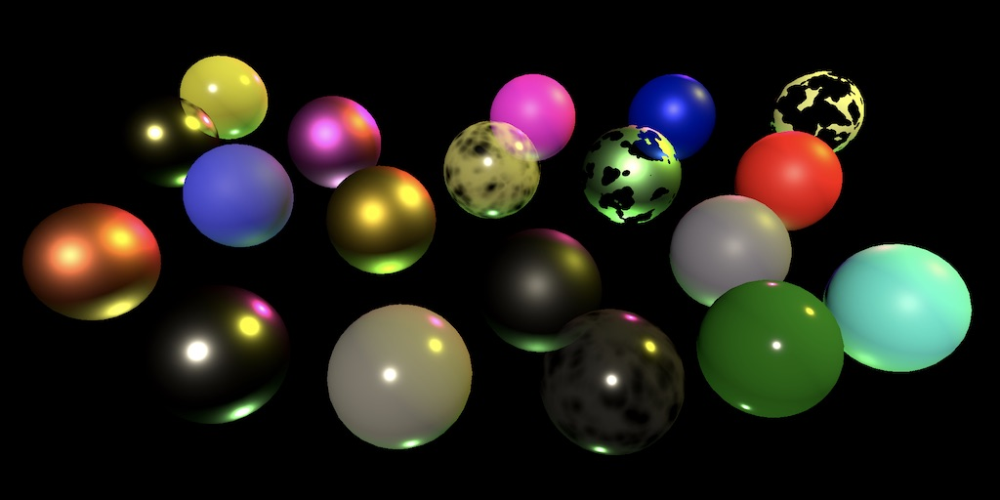

此篇为翻译，[原文链接点此](https://catlikecoding.com/unity/tutorials/custom-srp/directional-lights/)

#平行光&emsp;*直接光照*

&emsp;*使用法线向量计算光照*
&emsp;*支持四盏平行光*
&emsp;*使用 BRDF（双向反射分布函数）*
&emsp;*制作受光透明材质*
&emsp;*创建带有预设的自定义着色器GUI*

这是关于创建[自定义渲染管线](https://catlikecoding.com/unity/tutorials/custom-srp/)系列教程的第三部分。它新增了对多平行光着色的支持。

本篇教程基于Unity 2019.2.12f1。

